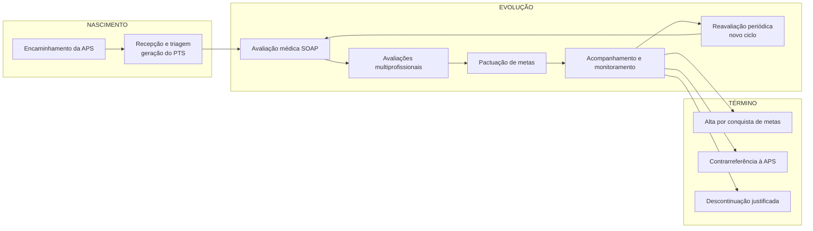
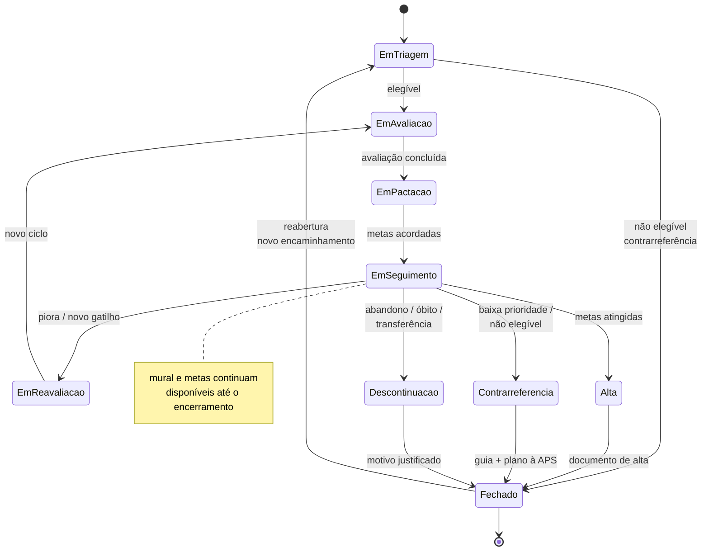

# Pergunta 1 — Processo Assistencial: Levantamento de Requisitos

## Como nasce, evolui e termina um PTS

---

## 1. Objetivo

Descrever — em nível de requisitos de sistema — o ciclo de vida completo do Projeto Terapêutico Singular (PTS) nos Centros Especializados em Reabilitação (CER): seus gatilhos de início, as etapas de evolução, os eventos que o modificam e as formas de encerramento. Este documento é a tradução funcional do PTS (ferramenta da Clínica Ampliada / PNH, ver plano/01) no fluxo de um sistema digital.

---

## 2. Visão Geral do Ciclo de Vida

O PTS nasce de um **encaminhamento** para o CER, evolui por ciclos de **avaliação → pactuação → acompanhamento → reavaliação** e termina em uma de **três formas**: alta por conquista de metas, contrarreferência à APS ou descontinuação justificada.

---

## 3. NASCIMENTO do PTS

### 3.1 Gatilho de Início

| Evento | Descrição | Requisito do sistema |
|---|---|---|
| Encaminhamento da APS (USF) | Paciente chega ao CER por encaminhamento da Atenção Primária, com CID e motivo registrados no e-SUS PEC | Registrar origem do encaminhamento e UBS de origem |
| Procura espontânea/judicial | Casos excepcionais, sem pactuação territorial ativa | Fluxo "cadastro provisório" com justificativa e pendência de 15 dias |
| Alta de internação / pós-cirúrgico | Pacientes em fase aguda com janela crítica de reabilitação | Sinalizar caso como prioridade (semáforo vermelho) desde a entrada |

### 3.2 Etapa 1 — Recepção

- **Porta de entrada única** da Pessoa com Deficiência (PCD) no CER.
- Personagens: recepção, paciente, cuidador/familiares.

**Requisitos funcionais da recepção (nascimento):**
- RF-1.1 — Buscar paciente no e-SUS PEC por CPF ou CNS e pré-carregar cadastro, endereço, município, UBS vinculada e diagnóstico (CID/CIAP).
- RF-1.2 — Validar pactuação territorial (PPI): município pactuado → prossegue; não pactuado → bloqueio visual com tela de justificativa ou guia de redirecionamento.
- RF-1.3 — Importar "linha de base clínica": diagnósticos, alergias, medicações e histórico, sem redigitação. Campo com origem "importado e-SUS" editável com flag.
- RF-1.4 — Coletar mapeamento do cuidador: parentesco, idade, comorbidades e Escala Rápida de Sobrecarga (Zarit adaptada).
- RF-1.5 — Registrar consentimento LGPD (assinatura digital em tablet, WhatsApp ou Gov.br).
- RF-1.6 — Operar em modo offline (cache local) quando a conexão falhar, com sincronização posterior.
- RF-1.7 — Disparar notificação em loop fechado à eSF de origem (marcador "PTS ativo" no e-SUS PEC local + e-mail/SMS).

### 3.3 Etapa 2 — Triagem e Elegibilidade

- Define **se o caso pertence ao CER** e **com que prioridade**.
- Personagens: triador (enfermagem, serviço social ou regulador).

**Requisitos funcionais da triagem:**
- RF-2.1 — Guiar triagem em três eixos: clínico (CID e motivo), funcional (escala de independência em mobilidade, comunicação, cognição, autocuidado) e social (dados do cuidador).
- RF-2.2 — Aplicar regras de elegibilidade por escopo do CER (reabilitação física, intelectual, visual, auditiva): CID compatível → segue; incompatível → reprovação justificada com guia de contrarreferência.
- RF-2.3 — Classificar prioridade (Semáforo do Cuidado): Vermelho = admissão imediata; Amarelo = fila de espera ativa com tempo estimado; Verde = retorno à APS.
- RF-2.4 — Permitir ajuste clínico manual da classificação, com justificativa obrigatória e registro em auditoria.

### 3.4 Evento de Nascimento (em termos de sistema)

> Um PTS é **gerado** quando: paciente validado + triagem concluída + elegibilidade confirmada (ou prioridade definida). Nesse momento o sistema atribui: identificador único do PTS, profissional de referência, classificação de prioridade e data de abertura. O PTS nasce "ativo", vinculado a um único usuário e a uma equipe de referência.

---

## 4. EVOLUÇÃO do PTS

### 4.1 Etapa 3 — Avaliação Médica (SOAP)

- Personagem: médico (fisiatra).
- Confere o diagnóstico, define o diagnóstico funcional, traça o plano inicial de serviços.

**Requisitos funcionais:**
- RF-3.1 — Prontuário estruturado SOAP: Subjetivo (queixas relatadas com botões de marcação rápida), Objetivo (exame físico com escalas clínicas e score automático — Ashworth, Glasgow), Avaliação (CID/CIAP confirmados + diagnóstico funcional e prognóstico), Plano (prescrição de serviços e frequência).
- RF-3.2 — Painel de "Divergência Saudável": comparar necessidades relatadas (família) × percebidas (clínica) e sinalizar desalinhamento para alinhamento de expectativas.
- RF-3.3 — Grade de serviços: tabela com especialidade, frequência, duração de ciclo e justificativa; notificação automática às agendas das terapias.

### 4.2 Etapa 4 — Avaliações Multiprofissionais

- Personagens: fisioterapeuta, terapeuta ocupacional, psicólogo (e demais).
- Cada categoria avalia dentro do seu escopo, sempre vinculada ao mesmo PTS.

**Requisitos funcionais:**
- RF-4.1 — Abas de avaliação por especialidade: Fisioterapia (CIF — mobilidade, força, fatores ambientais), Terapia Ocupacional (AVDs, órteses e adaptações), Psicologia (cognitivo, suporte emocional, avaliação do cuidador).
- RF-4.2 — Preenchimento preditivo da CIF: checklist visual do terapeuta gera códigos CIF em background, sem digitação manual de códigos.

### 4.3 Etapa 5 — Pactuação de Metas

- Personagens: equipe, profissional de referência, usuário, cuidador.
- A essência da cogestão: as metas são **negociadas**, não impostas.

**Requisitos funcionais:**
- RF-5.1 — Registrar metas no formato SMART (específica, mensurável, alcançável, relevante, com prazo), cada uma com dono e status.
- RF-5.2 — Apresentar metas em dupla linguagem: técnica (profissional) e acessível (usuário/cuidador).
- RF-5.3 — Painel de Metas Cruzadas: todas as metas de todas as especialidades do mesmo usuário em uma única tela, com indicação de conflitos de prazo ou de foco.
- RF-5.4 — Mural interno (timeline assíncrona) para discussão contextualizada entre profissionais do caso.
- RF-5.5 — Semáforo de reunião: Vermelho → reunião presencial obrigatória; Amarelo → discussão assíncrona; Verde → aprovação digital padrão.

### 4.4 Etapa 6 — Acompanhamento e Registro de Eventos

- Personagens: toda a equipe, profissional de referência.

**Requisitos funcionais:**
- RF-6.1 — Registrar eventos de cuidado (sessões, atendimentos, faltas) vinculados ao PTS, com data, profissional e tipo.
- RF-6.2 — Notificar o profissional de referência de eventos relevantes (falta, piora, divergência de metas).
- RF-6.3 — Calcular e exibir o status do PTS em tempo real: "em avaliação", "em pactuação", "em seguimento", "em reavaliação", "em risco de descontinuação".

### 4.5 Reavaliação Periódica (o loop de evolução)

- O PTS é **dinâmico**: muda conforme evolução clínica, funcional e social.

**Requisitos funcionais:**
- RF-7.1 — Sincronização inteligente de agendas: sugerir janelas comuns de reavaliação entre os profissionais do caso.
- RF-7.2 — Triggers de revisão: prazo pactuado vencido, piora funcional registrada, solicitação do profissional de referência ou do usuário, alta hospitalar.
- RF-7.3 — Versionar cada revisão do PTS: manter histórico íntegro (linha do tempo) de metas, avaliações e planos anteriores.

---

## 5. TÉRMINO do PTS

### 5.1 Formas de Encerramento

| Forma | Condição | Requisito funcional |
|---|---|---|
| **Alta por conquista de metas** | Metas pactuadas alcançadas e mantidas; autonomia funcional | Gerar documento de alta com resumo do percurso e orientações; notificar APS |
| **Contrarreferência à APS** | Caso manejável na Atenção Primária; baixa prioridade; não elegível | Gerar guia de contrarreferência inteligente (justificativa + plano de cuidados) e enviar ao e-SUS PEC da UBS |
| **Descontinuação justificada** | Abandono, óbito, transferência, solicitação do usuário ou impossibilidade técnica | Registrar motivo obrigatório; arquivar PTS com histórico preservado |

### 5.2 Regras de Encerramento

- RF-8.1 — Nenhum PTS pode ser encerrado sem motivo registrado (auditoria obrigatória).
- RF-8.2 — Todo encerramento dispara comunicação à APS de origem (loop fechado).
- RF-8.3 — PTS encerrado permanece acessível em modo "histórico" (somente leitura), preservando trilha de auditoria e suporte a dados para indicadores.
- RF-8.4 — Reabertura: PTS encerrado por contrarreferência pode ser "reativado" mediante novo encaminhamento, preservando o histórico anterior.

---

## 6. Mapa de Transições de Estado do PTS (Requisito Funcional de Estado)

**Regra de integridade:** em qualquer estado, o Mural e o Painel de Metas permanecem disponíveis à equipe; avaliações podem ser adicionadas até o encerramento.

---

## 7. Requisitos Funcionais Consolidados (resumo executivo)

| # | Requisito | Etapa |
|---|---|---|
| RF-1.1 a 1.7 | Cadastro, linha de base, PPI, cuidador, LGPD, offline, notificação | Nascimento (recepção) |
| RF-2.1 a 2.4 | Triagem, elegibilidade, semáforo, ajuste auditado | Nascimento (triagem) |
| RF-3.1 a 3.3 | SOAP, divergência saudável, grade de serviços | Evolução |
| RF-4.1 a 4.2 | Avaliações por especialidade, CIF preditiva | Evolução |
| RF-5.1 a 5.5 | Metas SMART, linguagem acessível, metas cruzadas, mural, semáforo de reunião | Evolução (cogestão) |
| RF-6.1 a 6.3 | Eventos, alertas, status do PTS | Evolução (acompanhamento) |
| RF-7.1 a 7.3 | Reavaliação, triggers, versionamento | Evolução (loop) |
| RF-8.1 a 8.4 | Formas de encerramento e regras | Término |

Fonte: plano/03 (jornada), plano/05 (PRD), plano/06 (arquitetura).