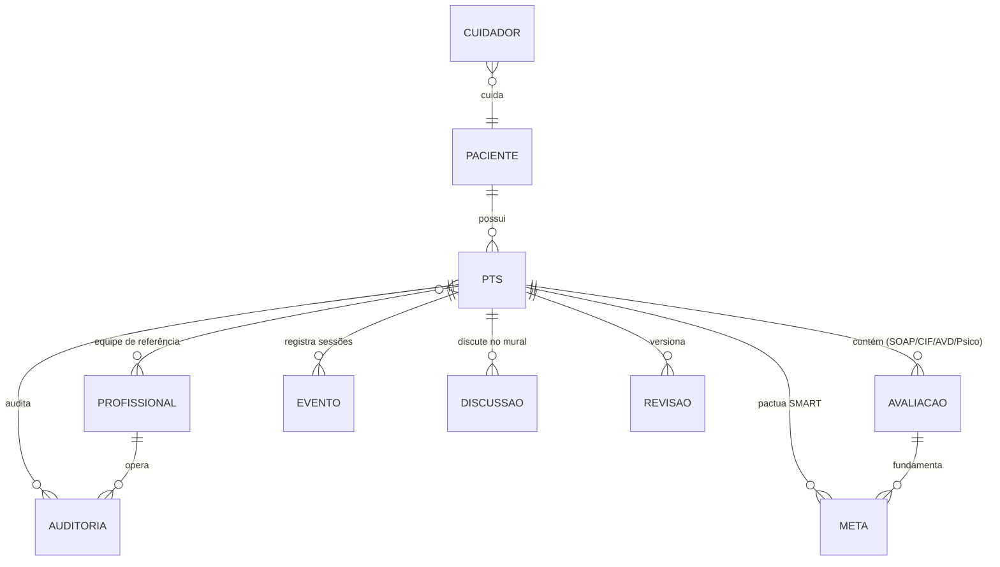

# Pergunta 2 — Dados: Modelagem

## Todas as informações a registrar no ciclo de vida do PTS

---

## 1. Objetivo

Identificar e organizar **todas as informações que o sistema precisa registrar** durante o ciclo de vida do PTS (nascimento → evolução → término, ver Pergunta 1), em nível de modelagem de dados conceitual. Cada dado é descrito com sua origem (importado do e-SUS, digitado, calculado), entidade dona e papel no fluxo.

---

## 2. Entidades Núcleo do Modelo

---

## 3. Dicionário de Dados por Fase

### 3.1 Fase NASCIMENTO — Recepção

| Dado | Tipo | Origem | Obrigatório | Observações |
|---|---|---|---|---|
| CPF / CNS | Identificador | e-SUS (busca) | Sim | Chave de busca da linha de base |
| Nome completo, data de nascimento, sexo | Cadastro | e-SUS | Sim | Pré-carregado, revisável |
| Endereço, bairro, município, microárea | Território | e-SUS | Sim | Base da validação PPI |
| UBS vinculada (CNES) e eSF de origem | Referência | e-SUS | Sim | Alvo da notificação em loop fechado |
| Diagnósticos ativos (CID-10 / CIAP-2) | Clínico | e-SUS | Sim | Linha de base clínica |
| Deficiências registradas | Clínico | e-SUS | Sim | Alimenta elegibilidade |
| Alergias | Clínico | e-SUS | Condicional | Sinalizadas em destaque |
| Medicações ativas | Clínico | e-SUS | Condicional | Histórico |
| Histórico de internações | Clínico | e-SUS | Condicional | |
| Município pactuado / PPI | Regra | Tabela local PPI | Sim | Resultado da validação territorial |
| Status da pactuação (ok / bloqueado / provisório) | Regra | Calculado | Sim | Cadastro provisório = flag + prazo 15 dias |
| Grau de parentesco do cuidador | Social | Digitado (pré-chegada) | Sim | Formulário pré-chegada via WhatsApp |
| Idade do cuidador | Social | Digitado | Sim | Detecta cuidador idoso/muito jovem |
| Comorbidades do cuidador | Social | Digitado | Condicional | |
| Escala Rápida de Sobrecarga (Zarit adaptada) | Social | Digitado (score) | Sim | Score calculado → alerta ao Serviço Social |
| Termo de consentimento LGPD | Legal | Assinatura digital | Sim | Data, canal (tablet/WhatsApp/Gov.br), documento |
| Origem do dado por campo | Metadado | Sistema | Sempre | `importado` vs. `digitado` vs. `calculado` |
| Data/hora da recepção | Temporal | Sistema | Sim | Alimenta métrica de tempo de recepção |
| Operador que realizou a recepção | Auditoria | Sistema | Sim | |

### 3.2 Fase NASCIMENTO — Triagem

| Dado | Tipo | Origem | Obrigatório | Observações |
|---|---|---|---|---|
| Motivo do encaminhamento | Clínico | Digitado | Sim | Texto livre + categorias |
| Eixo clínico (CID principal validado) | Clínico | Importado+validado | Sim | |
| Eixo funcional — mobilidade | Funcional | Slider (0–100) | Sim | 4 domínios |
| Eixo funcional — comunicação | Funcional | Slider | Sim | |
| Eixo funcional — cognição | Funcional | Slider | Sim | |
| Eixo funcional — autocuidado | Funcional | Slider | Sim | |
| Eixo social — composição familiar | Social | Digitado | Condicional | Cruzado com dados do cuidador |
| Eixo social — vulnerabilidades (pobreza, isolamento) | Social | Digitado | Condicional | |
| Resultado de elegibilidade (elegível/não elegível) | Regra | Calculado | Sim | Justificativa quando reprovado |
| Classificação do semáforo (Verde/Amarelo/Vermelho) | Regra | Calculado + ajustável | Sim | Ajuste manual exige justificativa |
| Justificativa de ajuste manual | Auditoria | Digitado | Condicional | Registrada em trilha |
| Profissional de referência definido | Gestão | Digitado | Sim | Atribuído no nascimento |
| Prioridade → vaga prioritária / fila de espera | Gestão | Calculado | Condicional | Vermelho abre vaga; amarelo entra na fila |

### 3.3 Fase EVOLUÇÃO — Avaliação Médica (SOAP)

| Dado | Tipo | Origem | Obrigatório | Observações |
|---|---|---|---|---|
| **S** — queixas relatadas | Clínico | Botões rápidos + texto | Sim | Linguagem do paciente/família |
| **S** — expectativas do paciente/família | Clínico | Digitado | Sim | Alimenta divergência saudável |
| **O** — exame físico | Clínico | Digitado | Sim | |
| **O** — escalas clínicas (Ashworth, Glasgow, etc.) | Clínico | Seleção → score | Condicional | Score calculado automaticamente |
| **A** — diagnóstico nosológico (CID/CIAP confirmado) | Clínico | Importado + refinado | Sim | |
| **A** — diagnóstico funcional e prognóstico | Clínico | Digitado | Sim | Potencial de reabilitação |
| **P** — prescrição de serviços | Clínico | Tabela (grade) | Sim | Especialidade, frequência, ciclo |
| **P** — justificativa clínica por serviço | Clínico | Digitado | Sim | |
| **P** — duração do ciclo e nº de sessões | Gestão | Digitado | Sim | |
| Divergência relatado × percebido | Analítico | Calculado | Sempre | Painel visual, não bloqueante |

### 3.4 Fase EVOLUÇÃO — Avaliações Multiprofissionais

| Dado | Tipo | Origem | Obrigatório | Observações |
|---|---|---|---|---|
| **Fisioterapia — CIF** (mobilidade, força, fatores ambientais) | Clínico | Checklist → códigos CIF | Sim | Códigos gerados em background |
| **Fisioterapia — objetivos funcionais** | Clínico | Digitado | Sim | |
| **T.O. — AVDs** (alimentação, higiene, vestuário) | Clínico | Checklist | Sim | |
| **T.O. — órteses e adaptações** | Clínico | Digitado | Condicional | |
| **Psicologia — aspectos cognitivos** | Clínico | Checklist | Condicional | |
| **Psicologia — suporte emocional** | Clínico | Digitado | Condicional | |
| **Psicologia — avaliação do cuidador** | Clínico | Digitado | Condicional | Vinculado ao mapeamento da recepção |
| Especialista avaliador, data | Auditoria | Sistema | Sim | |

### 3.5 Fase EVOLUÇÃO — Pactuação de Metas e Cogestão

| Dado | Tipo | Origem | Obrigatório | Observações |
|---|---|---|---|---|
| Metas SMART (descrição técnica) | Gestão | Digitado | Sim | Específica, mensurável, alcançável, relevante, prazo |
| Meta em linguagem acessível | Gestão | Digitado | Sim | Visível ao usuário/cuidador |
| Dono da meta (profissional responsável) | Gestão | Seleção | Sim | |
| Status da meta (nova/em andamento/concluída/não alcançada) | Gestão | Atualização | Sim | |
| Prazo pactuado e data de revisão | Gestão | Digitado | Sim | Base do NSM (revisão em dia) |
| Data de pactuação e participantes | Auditoria | Sistema | Sim | |
| Classificação do caso para reunião (semáforo) | Regra | Calculado | Sim | Presencial/assíncrono/digital |
| Discussões do mural (autor, texto, data) | Comunicação | Digitado | Condicional | Vinculado ao caso; não altera dados clínicos |

### 3.6 Fase EVOLUÇÃO — Acompanhamento

| Dado | Tipo | Origem | Obrigatório | Observações |
|---|---|---|---|---|
| Evento de cuidado (tipo: sessão/atendimento) | Clínico | Digitado | Sim | Data, profissional, tipo |
| Faltas e cancelamentos | Clínico | Digitado | Condicional | Dispara alerta ao referência |
| Observações de evolução | Clínico | Digitado | Condicional | |
| Status atual do PTS | Estado | Calculado | Sempre | em avaliação/pactação/seguimento/reavaliação |

### 3.7 Fase EVOLUÇÃO — Reavaliação (versões)

| Dado | Tipo | Origem | Obrigatório | Observações |
|---|---|---|---|---|
| Motivo/gatilho da reavaliação | Gestão | Seleção | Sim | Prazo vencido, piora, solicitação, alta hospitalar |
| Nova versão do PTS (metas, avaliações, plano) | Clínico | Digitado | Sim | Versionamento preserva anterior |
| Comparativo entre versões | Analítico | Calculado | Sempre | Evolução de metas e escores |
| Janelas de agenda sincronizadas | Gestão | Calculado | Condicional | Sugestão de reavaliação |

### 3.8 Fase TÉRMINO

| Dado | Tipo | Origem | Obrigatório | Observações |
|---|---|---|---|---|
| Forma de encerramento (alta/contrarreferência/descontinuação) | Gestão | Seleção | Sim | |
| Justificativa de encerramento | Auditoria | Digitado | Sim | Obrigatória em todos os casos |
| Resumo do percurso para alta | Clínico | Gerado | Sim | |
| Plano de cuidados para a APS | Clínico | Digitado | Condicional | Contrarreferência inteligente |
| Data de encerramento e responsável | Auditoria | Sistema | Sim | |
| Status final = FECHADO (histórico) | Estado | Calculado | Sempre | Somente leitura; reabertura possível |

---

## 4. Regras de Modelagem (Metadados)

| Regra | Descrição |
|---|---|
| **Rastreabilidade de origem** | Todo campo registra origem: `importado e-SUS`, `digitado`, `calculado`. Permite auditoria e métrica de retrabalho evitado |
| **Integridade referencial** | Toda avaliação, meta, evento e discussão pertence a um PTS; nenhum dado clínico órfão |
| **Versionamento** | Cada revisão do PTS é uma versão imutável; histórico integral preservado |
| **Linha do tempo** | Eventos e avaliações carimbados com data/hora; suportam análise de coorte (Pergunta 6) |
| **Mínimo necessário** | Coleta-se apenas o que a etapa precisa (minimização LGPD); linha de base importada seletivamente |
| **Auditoria** | Toda alteração de classificação, meta, justificativa ou encerramento registra autor, data e motivo |

---

## 5. Mapa Dado → Módulo do Sistema

| Módulo | Dados que registra |
|---|---|
| M1 Recepção | Paciente, cuidador, consentimento, linha de base, PPI |
| M2 Triagem | Triagem, elegibilidade, semáforo, contrarreferência |
| M3 SOAP | Avaliação médica estruturada, divergência |
| M4 Multiprofissional | Avaliações CIF/AVD/Psico |
| M5 Cogestão | Metas SMART, mural, semáforo de reunião |
| M6 Governança | Indicadores derivados (nunca dados novos) |

Fonte: plano/06 §3 (modelo conceitual) e Pergunta 1 (requisitos funcionais).