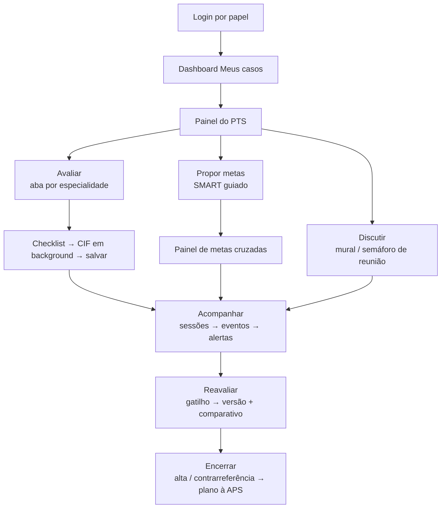

# Pergunta 5 — Experiência do Usuário: Casos de Uso, Requisitos Funcionais e UX

## Jornada completa de um profissional utilizando a aplicação

---

## 1. Objetivo

Construir a jornada completa de um profissional (com foco em **fisioterapeuta**, que atravessa os módulos centrais, e cobertura dos demais perfis) usando a aplicação, expressa em **casos de uso**, **requisitos funcionais** e **decisões de UX**.

---

## 2. Persona de Referência

**Carlos, 29 anos, fisioterapeuta do CER.**
Atende 12 usuários/dia; preenche avaliação CIF; participa de reuniões de equipe semanais; sofre com redigitação, metas desalinhadas e reuniões longas.

**Jobs to be Done:**
- Registrar avaliação funcional rapidamente, sem digitar códigos CIF.
- Ver as metas de todas as especialidades na mesma tela.
- Ajustar conduta com colegas sem esperar reunião.
- Saber quando (e como) revisar o PTS de cada caso.

---

## 3. Jornada Completa do Profissional (Fisioterapeuta)

### Etapa A — Login e Entrada

| Momento | Ação do usuário | Resposta do sistema | Decisão de UX |
|---|---|---|---|
| A1 | Abre a aplicação (computador do CER) | Tela de login com Gov.br ou credencial | Login único; pouco atrito |
| A2 | Autentica-se | Dashboard "Meus casos hoje" | **Home por função:** terapeuta vê sua agenda e casos vinculados, não menu genérico |
| A3 | Vê lista de casos | Cards com status do PTS (em avaliação/seguimento/reavaliação), prioridade (semáforo) e alertas | Semáforo visual; status em linguagem de trabalho |

### Etapa B — Primeiro Contato com Novo Caso

| Momento | Ação | Resposta | UX |
|---|---|---|---|
| B1 | Abre caso novo (pós SOAP médico) | Painel do PTS com linha do tempo e dados pré-carregados | Contexto completo em uma tela |
| B2 | Consulta grade de serviços | Vê que foi solicitado: "Fisioterapia 3x/sem, 12 semanas — treino de controle de tronco" | Requisição do médico clara, com justificativa |
| B3 | Confere metas/mural | Vê discussões de triagem e do médico | Mural visível, sem sobrecarga |

### Etapa C — Avaliação Fisioterapêutica (CIF)

| Momento | Ação | Resposta | UX |
|---|---|---|---|
| C1 | Abre aba "Fisioterapia" | Checklist visual de avaliação funcional | **Abas por especialidade** — só o escopo da fisio |
| C2 | Marca itens: mobilidade, força, fatores ambientais | Sistema gera **códigos CIF em background** | **Preenchimento preditivo** — terapeuta não digita códigos |
| C3 | Escreve objetivos funcionais | Campos com sugestão de texto e campo livre | Autocompletar + liberdade |
| C4 | Salva | Registro assinado, linha do tempo atualizada, auditoria | Salvar em um clique; "salvou e confirmou" visível |

### Etapa D — Pactuação de Metas

| Momento | Ação | Resposta | UX |
|---|---|---|---|
| D1 | Propõe metas | Formulário SMART com campos guiados (específico, mensurável, prazo) | Fórmula guiada > campo em branco |
| D2 | Escolhe "dono da meta" e prazo | Meta aparece no **Painel de Metas Cruzadas** | Metas de todas as especialidades em uma tela |
| D3 | Revisa com a equipe em reunião ou mural | Semáforo de reunião indica via: presencial/assíncrono/digital | A ferramenta diz *como* discutir, não só o quê |
| D4 | Pacua com usuário | Meta convertida para **linguagem acessível** exibida no portal do usuário | Dupla linguagem por padrão |

### Etapa E — Acompanhamento e Ciclo

| Momento | Ação | Resposta | UX |
|---|---|---|---|
| E1 | Registra sessões do dia | Cada sessão vira evento no PTS; agenda atualiza | Registro rápido (mínimos cliques) |
| E2 | Registra falta do usuário | Alerta automático ao profissional de referência | Notificação backstage, sem tomar tempo |
| E3 | Ajusta conduta | Publica no mural do caso, notifica participantes | Discussão assíncrona contextualizada |
| E4 | Recebe alerta de reavaliação | Sistema sugere janelas comuns de agenda entre as disciplinas | Sincronização inteligente de agenda |

### Etapa F — Revisão e Encerramento do Caso

| Momento | Ação | Resposta | UX |
|---|---|---|---|
| F1 | Participa de reavaliação | Nova versão do PTS; comparativo com versão anterior | Versionamento visível: "o que mudou?" |
| F2 | Metas alcançadas | Sugestão de alta por conquista | Fluxo direcionado, com motivo |
| F3 | Encaminha encerramento | Alta/contrarreferência à APS com resumo e plano | Um fluxo, pré-preenchido, revisável |

---

## 4. Casos de Uso

### 4.1 Conjunto principal (casos de uso do sistema)

| UC | Caso de uso | Ator | Descrição |
|---|---|---|---|
| UC-01 | Autenticar e acessar dashboard por papel | Todos | Login + home configurada por função |
| UC-02 | Visualizar casos vinculados | Profissional | Lista de PTS do profissional com status e prioridade |
| UC-03 | Acessar painel do PTS de um caso | Profissional | Visão unificada: linha do tempo, avaliações, metas, mural |
| UC-04 | Avaliar caso na própria especialidade | Terapeuta/Médico | Registro de avaliação (checklist/CIF/SOAP) |
| UC-05 | Propor e pactuar metas SMART | Equipe | Registro de metas com dono, prazo e linguagem acessível |
| UC-06 | Visualizar metas cruzadas | Equipe | Painel integrado de metas de todas as especialidades |
| UC-07 | Discutir caso no mural | Equipe | Comentários assíncronos vinculados ao PTS |
| UC-08 | Registrar evento de cuidado | Profissional | Sessão/atendimento com data, tipo, observação |
| UC-09 | Classificar reunião de equipe | Equipe | Semáforo de reunião (presencial/assíncrono/digital) |
| UC-10 | Receber/acionar gatilho de reavaliação | Profissional de referência | Alerta de prazos e sugestão de agendas |
| UC-11 | Revisar e versionar o PTS | Referência/Equipe | Nova versão com comparativo |
| UC-12 | Encerrar PTS (alta/contrarreferência) | Referência | Fluxo de encerramento com motivo e plano à APS |
| UC-13 | Consultar relatórios e indicadores | Gestor | Dashboards (ver Pergunta 6) |
| UC-14 | Acompanhar próprio percurso e consentir | Usuário/Cuidador | Portal do cidadão |

### 4.2 Fluxo principal detalhado (UC-04 → UC-05 → UC-06 — o coração do uso clínico)

1. Terapeuta abre caso (UC-03).
2. Aba da especialidade exibe checklist (UC-04). Marca itens → CIF gerada em background.
3. Salva. Sistema notifica participantes do caso.
4. Propõe metas (UC-05): forma guiada SMART, dono, prazo.
5. Metas entram no painel cruzado (UC-06). Conflitos de prazo sinalizados.
6. Discute ajustes no mural (UC-07) ou decide reunião (UC-09).
7. Registra pactuação com o usuário em linguagem acessível (UC-05).

---

## 5. Requisitos Funcionais (UX-centric)

| # | Requisito funcional | Relacionado a |
|---|---|---|
| RF-UX-1 | Dashboard **por papel**: cada perfil abre direto na visão do seu trabalho | UC-01, UC-02 |
| RF-UX-2 | Painel unificado do PTS com linha do tempo, status (semáforo), avaliações, metas e mural em uma tela | UC-03 |
| RF-UX-3 | **Abas por especialidade**: cada profissional vê apenas o escopo da sua área | UC-04 |
| RF-UX-4 | **Preenchimento preditivo CIF**: checklist visual → códigos gerados em background; nenhuma digitação de código | UC-04 |
| RF-UX-5 | **Fórmula guiada de metas SMART** com autocompletar e campo livre | UC-05 |
| RF-UX-6 | **Dupla linguagem de metas**: técnica (equipe) e acessível (usuário) sincronizadas | UC-05 |
| RF-UX-7 | Painel de **metas cruzadas** com detecção visual de conflitos de prazo/foco | UC-06 |
| RF-UX-8 | **Mural assíncrono** contextualizado por caso, com notificação de participantes | UC-07 |
| RF-UX-9 | Registro de evento/sessão em **mínimos cliques** (data, tipo, obs) | UC-08 |
| RF-UX-10 | **Semáforo de reunião** sugerindo canal de discussão por complexidade | UC-09 |
| RF-UX-11 | Alertas de reavaliação e sugestão de **janelas comuns de agenda** | UC-10 |
| RF-UX-12 | Versionamento com comparativo "o que mudou" | UC-11 |
| RF-UX-13 | Fluxo de encerramento pré-preenchido (resumo + plano à APS) | UC-12 |
| RF-UX-14 | Portal do usuário em **linguagem simples** e padrões de acessibilidade | UC-14 |

---

## 6. Princípios de UX Aplicados

| Princípio | Aplicação |
|---|---|
| **Menos é mais** | Home por papel; abas por especialidade; nada de screens genéricos |
| **Zero retrabalho percêsso** | Pré-carregamento (e-SUS), autocompletar, checklist preditivo; o sistema pede o mínimo que o profissional não pode preencher sozinho |
| **Progresso é visível** | Status do PTS em semáforo; linha do tempo; comparativo de versões |
| **Comunicação no contexto** | Mural dentro do caso, não em ferramenta separada; notificações discretas (backstage) |
| **Clínica manda** | Nada bloqueia decisão: ajustes com justificativa, divergência saudável apenas sinaliza |
| **Acessível ao cuidado** | Metas em linguagem acessível ao usuário; interface do portal simples e inclusiva (LBI) |

---

## 7. Fluxograma da Jornada (resumo visual)

Fonte: plano/03 (jornada e personas) e plano/05 (PRD e backlog WWA).