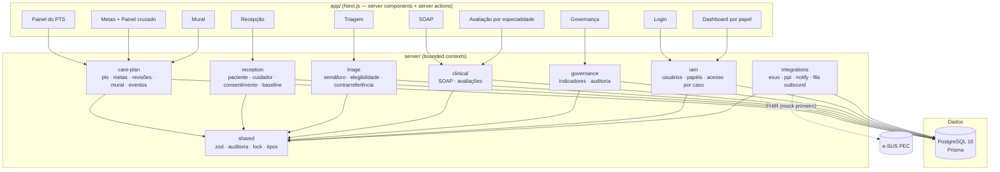
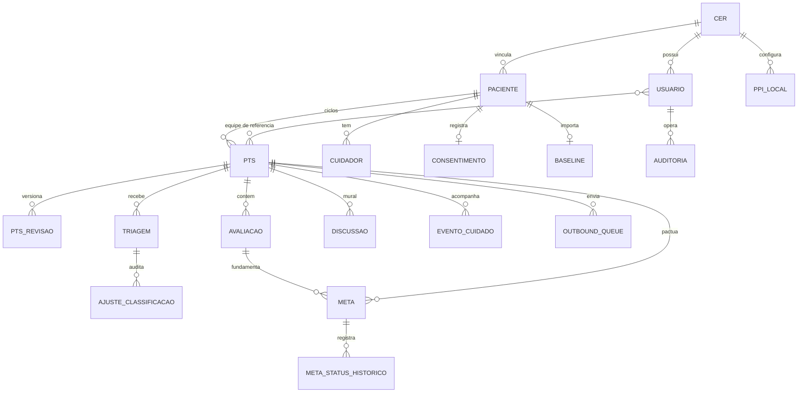
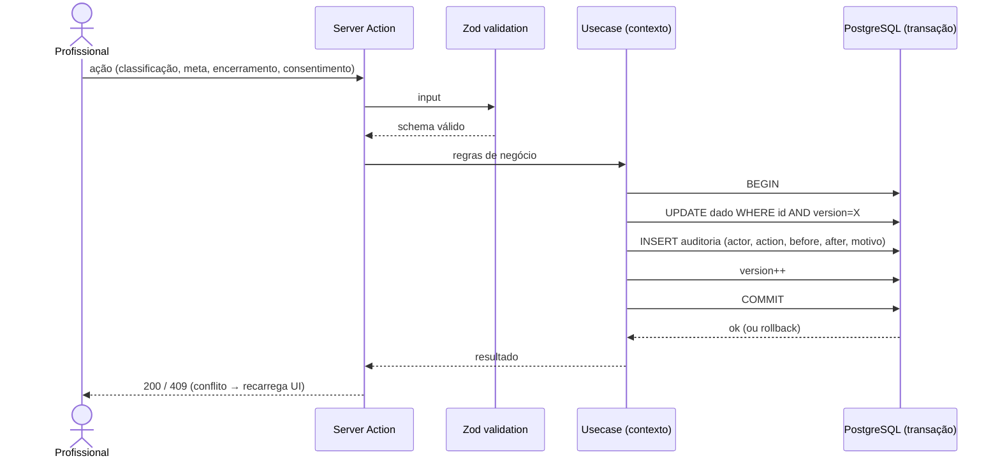
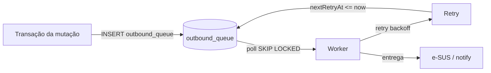
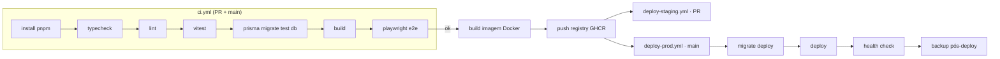

# Diagrama — Arquitetura Técnica

> Complemento visual de `plano/11` (arquitetura), `plano/12` (dados) e `plano/15` (CI/CD). Renderiza automaticamente no GitHub.

## 1. Arquitetura em camadas (monólito modular)

Regra de dependência: `app → server/{contexto} → prisma`. `shared` não importa contexto nenhum. Contextos não se importam diretamente.

## 2. Modelo entidade-relacionamento (físico)

FK `RESTRICT` em todo dado clínico filho do PTS (nada órfão). Detalhe por tabela: `plano/12`.

## 3. Transação crítica (mutação + auditoria)

## 4. Fila outbound (worker)

## 5. Pipeline CI/CD

Gates: CI falhou → sem deploy. Alvo de deploy (VPS/plataforma) plugável — ADR 0007.
