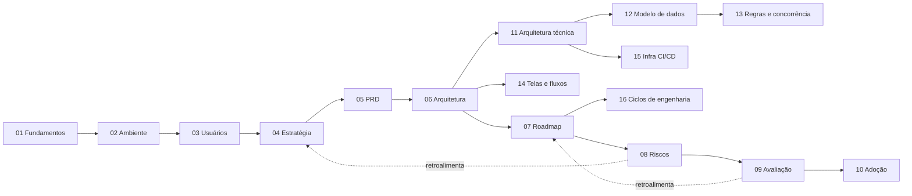

# PTS Digital — Plano de Formulação e Desenvolvimento

## Índice de Navegação

Este conjunto de documentos estrutura, da base teórica à implementação digital, a plataforma de gestão do **Projeto Terapêutico Singular (PTS)** para **Centros Especializados em Reabilitação (CER)** no SUS.

## Documentos-Fonte

| Arquivo | Conteúdo | Papel no Plano |
|---|---|---|
| `pts.md` | Fundamentos teóricos e conceituais do PTS | Base dos docs 01, 02 e 03 |
| `Plano Terapêutico Singular (PTS) Digital - Estrutura e Funcionalidades.md` | Arquitetura funcional da solução digital | Base dos docs 05 e 06 |
| `Plano Terapêutico Singular (PTS) - Guia de Implementação Operacional.md` | Visão operacional e módulos do sistema | Base dos docs 05, 06 e 07 |

## Etapas do Plano

| # | Documento | Objetivo | Responde a |
|---|---|---|---|
| 00 | **index.md** (este) | Mapa de navegação e leitura | Por onde começar? |
| 01 | **fundamentos-teoricos.md** | Base teórico-conceitual e marco normativo consolidado | O que é PTS e por que existe? |
| 02 | **diagnostico-ambiente.md** | Análise do ambiente: PESTLE, 5 Forças, SWOT, concorrentes | Em que mundo essa solução entra? |
| 03 | **descoberta-usuarios.md** | Personas, jornadas, dores e jobs to be done | Para quem e para quê? |
| 04 | **estrategia-produto.md** | Visão, posicionamento, modelo de negócio, north star | Como vamos vencer? |
| 05 | **prd-requisitos.md** | PRD completo: 6 módulos, MVP, histórias e critérios | O que exatamente vamos construir? |
| 06 | **arquitetura-dados.md** | Arquitetura em nível de produto, dados, integrações, LGPD | Como o produto se estrutura? |
| 07 | **roadmap-implementacao.md** | Fases, marcos, piloto, capacidade e go/no-go | Quando e em que ordem? |
| 08 | **riscos-redteam.md** | Assumptions, pre-mortem, red team | Onde o plano pode quebrar? |
| 09 | **governanca-avaliacao.md** | Indicadores, dashboards, avaliação de impacto | Como saber se funcionou? |
| 10 | **adocao-crescimento.md** | Treinamento, mudança de cultura, expansão | Como chegar ao cotidiano dos serviços? |
| 11 | **arquitetura-tecnica.md** | Stack final, camadas, bounded contexts, integrações | Como é a arquitetura técnica? |
| 12 | **modelo-de-dados.md** | ER físico, dicionário de tabelas, constraints, índices | Como os dados se relacionam? |
| 13 | **regras-negocio-concorrencia.md** | Semáforo, elegibilidade, auditoria, lock, filas | Como garantimos regras e concorrência? |
| 14 | **telas-e-fluxos.md** | Telas priorizadas, navegação, princípios UX | Quais telas e em que ordem? |
| 15 | **infra-ci-cd-deploy.md** | Docker, GitHub Actions, ambientes, backup, segurança | Como rodar, testar e publicar? |
| 16 | **ciclos-engenharia.md** | Fluxo Superpowers, TDD, rituais, ordem de construção | Como trabalhar durante o build? |

## Ordem de Leitura

- **Estratégica** (visão geral): 00 → 01 → 04 → 07 → 08
- **Linear completa** (recomendada): 00 → 01 → 02 → 03 → 04 → 05 → 06 → 07 → 08 → 09 → 10
- **Técnica** (planejamento operacional): 11 → 12 → 13 → 14 → 15 → 16 (decisões em `docs/adr/`)
- **Consultas pontuais**: cada documento é autocontido e referenciável de forma isolada

## Diagrama de Dependências

Cada documento consome o anterior como entrada. As seções 08 (riscos) e 09 (avaliação) retroalimentam os documentos de estratégia e roadmap em ciclos de revisão. Os docs 11–16 são o plano técnico/operacional de implementação, derivado dos docs 05–07.

## Nota Metodológica

O plano foi construído com o método de Product Management estruturado: análise estratégica de ambiente (PESTLE, 5 Forças, SWOT), descoberta centrada no usuário (personas, jornadas, JTBD), estratégia de produto (Product Strategy Canvas), especificação (PRD, WWA, user stories), arquitetura em nível de produto, governança por métricas (North Star, health metrics) e disciplina de risco (pre-mortem, red team).
