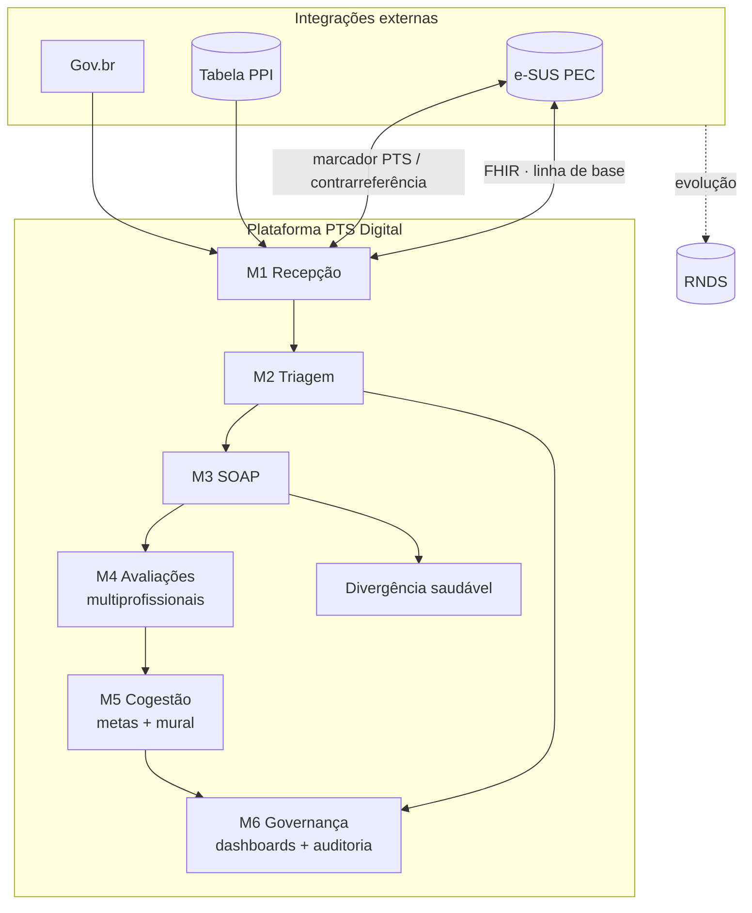

# 06 — Arquitetura em Nível de Produto, Dados e Integrações

> **Input:** `01`–`05`, documentos-fonte · **Skills:** `shipping-artifacts`, `customer-journey-map`

> **Nota de nível:** este documento especifica a arquitetura **em nível de produto** — módulos, dados, integrações, fluxos e governança — sem decisão de stack tecnológica (função do plano). Detalhes de implementação são delegados ao roadmap (doc 07) e ao desenvolvimento.

## 1. Princípios de Arquitetura

1. **O PTS é o agregador** — tudo (avaliações, metas, registros) orbita o PTS do usuário; nenhum dado clínico existe fora de um contexto de PTS.
2. **Complementar ao e-SUS, nunca substituto** — o sistema integra e consome e-SUS PEC; não duplica a infraestrutura pública.
3. **Resiliência primeiro** — o fluxo do CER nunca pode parar por indisponibilidade de integração: modo offline é regra, não exceção.
4. **Dados de saúde são sensíveis** — mínimos, retrospetáveis, auditáveis e com consentimento explícito (LGPD).
5. **Interfaces por papel e contexto** — cada profissional vê a visão necessária ao seu trabalho; o usuário vê linguagem acessível.

## 2. Visão de Módulos e Fluxo

## 3. Modelo de Dados Conceitual

### 3.1 Entidades núcleo

| Entidade | Descrição | Relações-chave |
|---|---|---|
| **Paciente (PCD)** | Usuário no CER; origem e-SUS | 1—N PTS |
| **Cuidador** | Responsável/familiar; carga biopsicossocial (Zarit, vulnerabilidades) | N—1 Paciente |
| **PTS** | Projeto Terapêutico Singular do usuário | 1—N Avaliações, Metas, Eventos |
| **Avaliação** | Registro estruturado por especialidade (SOAP de M3; CIF/AVD/etc. de M4) | N—1 PTS |
| **Meta** | Pactuação SMART (dono, status, prazo, linguagem acessível) | N—1 PTS; N—1 Avaliação |
| **Evento de cuidado** | Sessão/atendimento registrado (data, profissional, tipo) | N—1 PTS |
| **Discussão (Mural)** | Mensagens assíncronas contextualizadas ao caso | N—1 PTS |
| **Profissional** | Usuário do sistema; papéis e permissões | N—M PTS (equipe de referência) |
| **Registro de auditoria** | Trilha imutável de ações de segurança e ajustes manuais | N—1 qualquer entidade |

### 3.2 Visão da jornada → entidades

| Fluxo (doc 05) | Entidades tocadas |
|---|---|
| M1 Recepção | Paciente, Cuidador, Consentimento LGPD, Linha de base (origem e-SUS) |
| M2 Triagem | Triagem (eixos clínico/funcional/social), Classificação (semáforo), Contrarreferência |
| M3 SOAP | Avaliação médica (SOAP estruturado), Divergência relatado×percebido |
| M4 Multiprof. | Avaliações por especialidade (CIF, AVD, Psico) |
| M5 Cogestão | Metas SMART, Discussões, Semáforo de reunião, Painel de metas cruzadas |
| M6 Governança | Indicadores derivados, trilha de auditoria |

### 3.3 Metadados e integridade

- **Origem de dado** em cada campo: `importado (e-SUS)` vs. `digitado` vs. `calculado` — a linha de base é revisável e auditável.
- **Versão e linha do tempo**: cada estado do PTS referente a seu período de vigência; metas vinculadas a ciclos de revisão.
- **Auditoria**: toda alteração de classificação, meta ou justificativa registra autor, data/hora e motivo.

## 4. Integrações Externas

| Integração | Direção | Uso | Contingência |
|---|---|---|---|
| **e-SUS PEC (API FHIR)** | Leitura: cadastro, diagnósticos (CID/CIAP), medicações, alergias, histórico | Linha de base clínica (M1); elegibilidade (M2) | Modo offline/cache com sincronização |
| **e-SUS PEC (local)** | Escrita: "Marcador de PTS Ativo" + guia de contrarreferência | Notificação em loop fechado (M1); continuidade APS (M2) | Enfileiramento + reenvio; confirmação de entrega |
| **Gov.br** | Assinatura e autenticação digital | Consentimento LGPD (M1) | Assinatura em tablet/local como alternativa |
| **PPI (tabela pactuação)** | Leitura local configurável | Validação territorial (M1) | Tabela local; sem dependência de rede |
| **SMS/e-mail** | Notificações | Avisos à eSF e usuário (M1, M2) | Fila de envio|

### 4.1 Tratamento de falhas (padrão)

- **Tudo passa por fila local** quando a rede falha; sincronização automática ao restabelecer.
- **Nada trava a recepção**: indisponibilidade de API degrada para cadastro provisório com flag.
- **Confirmação de entrega** para notificações críticas (marcador e-SUS, contrarreferência).

## 5. Papéis e Permissões (nível produto)

| Papel | Escopo | Ações |
|---|---|---|
| **Recepção** | Paciente/Cuidador do dia | Cadastro, consentimento, mapeamento do cuidador |
| **Triador (enfermagem/social)** | Casos em triagem | Triagem, semáforo, ajuste justificado, contrarreferência |
| **Médico** | PTS do caso | SOAP, grade de serviços, divergência |
| **Terapeutas (Fisio/TO/Psico)** | PTS do caso | Avaliação por especialidade, metas, mural |
| **Profissional de referência** | PTS sob sua referência | Acompanhamento, articulação, revisões do PTS |
| **Gestor** | CER inteiro | Dashboards, relatórios, auditoria (somente leitura de dados clínicos) |
| **Usuário/Cuidador (portal)** | Próprios dados | Visualização do percurso, metas em linguagem acessível, consentimento |

Princípio de menor privilégio: nenhum papel vê além do necessário ao seu job. Dados clínicos completos somente pela equipe do caso.

### 5.1 Controle de acesso (RBAC configurável — ADR-0009)

A matriz acima é o **padrão inicial**, não um conjunto fixo de código. O controle de acesso é **data-driven**:

- **Catálogo de papéis** (`papel`) criado pelo admin da organização; cada papel tem base `CLINICO | GESTOR | ADMIN`.
- **Catálogo de recursos** (`recurso`) fixo do sistema (ex.: `soap.ler`, `triagem.escrever`, `dashboard.ver`).
- **Matriz `papel_recurso`**: admin marca/desmarca o que cada papel vê e faz.
- **Um papel por usuário**; permissão efetiva = união dos recursos do papel.
- **Guardrails em código** (não configuráveis): gestor nunca ganha recurso clínico; recursos de admin restritos à base `ADMIN`; mudanças de permissão auditadas. Ver `plano/17`.

## 6. Governança de Dados e LGPD

- **Base legal:** consentimento explícito para tratamento de dados sensíveis de saúde + finalidades legítimas de cuidado.
- **Minimização:** coleta apenas dados necessários à função; linha de base importada de forma seletiva por etapa.
- **Consentimento:** registro digital assinado (Gov.br/tablet/WhatsApp), com revogabilidade e trilha.
- **Retenção:** prazos alinhados à norma de prontuário; direito ao esquecimento quando legalmente aplicável.
- **Segurança:** dados sensíveis criptografados; acessos com registro; auditoria inviolável.
- **Comunicação de incidentes:** procedimento de notificação definido em caso de vazamento.

## 7. Fluxos Transversais (pontos de atenção na especificação)

### 7.1 Notificação em loop fechado (M1)
1. PTS gerado no CER → 2 contato e-SUS PEC local → 3. painel "Cidadão em acompanhamento de PTS no CER: [nome]" ao abrir a ficha na USF → 4. confirmação de entrada no histórico; 5. em caso de falha → reenvio programado com alerta ao operador.

### 7.2 Divergência saudável (M3)
- Mapa de itens comparáveis (relatado × percebido); sistema sinaliza desalinhamento sem bloquear — sempre direcional, nunca decisório.

### 7.3 Semáforo de reunião (M5)
- Classificação de complexidade deriva o canal: Vermelho → reunião presencial; Amarelo → discussão assíncrona; Verde → aprovação digital padrão. Regra configurável por CER.

### 7.4 Ajuste clínico manual (M2)
- Qualquer divergência do algoritmo exige justificativa → auditoria; configurável para exigir segundo leitor em casos vermelhos.

## 8. Indicadores Tecnológicos a Garantir (heredados para doc 09)

- Tempo de recepção médio ≤ 2 min (linha de base vs. manual).
- % de campos importados vs. digitados (medida de retrabalho evitado).
- Confiabilidade de sincronização offline: % de sincronizações bem-sucedidas; tempo de pendência.
- % de decisões algorítmicas ajustadas manualmente (mede precisão do modelo e confiança clínica).

## 9. Limites de Escopo (não é isto)

- **Não é** prontuário genérico nem RNDS (não substitui infraestrutura pública).
- **Não é** sistema de agenda institucional (apenas sincronização de reavaliações).
- **Não é** automação de decisão clínica (algoritmo auxilia; clínica decide).
- **Não é** plataforma de teleatendimento (teleavaliação pode ser evolução futura, fora do núcleo).