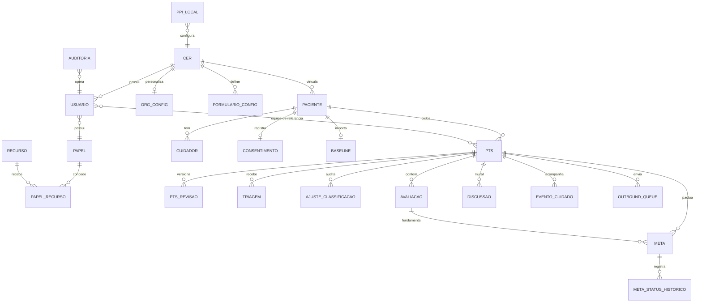

# 12 — Modelo de Dados

> **Input:** `Perguntas/02` (dicionário de dados), `plano/06` §3 · **Decisões:** ADR 0003, 0004, 0005 · **Nível:** modelo físico (Prisma → PostgreSQL 16)

## 1. Diagrama ER

## 2. Dicionário de tabelas

### `cer`
Tenant do sistema (unidade de saúde). Presente em toda tabela clínica para habilitar RLS futuro sem migração.

| Coluna | Tipo | Notas |
|---|---|---|
| id | uuid PK | |
| nome | text | |
| municipio | text | PPI |
| escopos | enum[] | FISICA / INTELECTUAL / VISUAL / AUDITIVA (elegibilidade) |

### `usuario`
Profissional ou papel administrativo. Papel via FK para `papel` (RBAC data-driven, ADR-0009); acesso a caso via equipe.

| Coluna | Tipo | Notas |
|---|---|---|
| id | uuid PK | |
| cerId | fk → cer | |
| papelId | fk → papel | papel único (catálogo dinâmico) |
| status | enum | PENDENTE / ATIVO / BLOQUEADO (admissão) |
| email | citext unique | |
| senhaHash | text | Argon2/bcrypt |
| nome | text | |
| categoria | enum | metadado informativo (recepção, triador, médico, fisio, to, psico...) |
| camposDinamicosJson | jsonb | campos pessoais definidos pela org (`formulario_config`) |

### `papel`
Catálogo dinâmico de papéis por org (substitui enum fixo — ADR-0009).

| Coluna | Tipo | Notas |
|---|---|---|
| id | uuid PK | |
| cerId | fk → cer | |
| nome | text | "Fisioterapeuta", "Cargo de limpeza"... |
| descricao | text | |
| base | enum | CLINICO / GESTOR / ADMIN (ancora guardrails) |
| ativo | bool | papel em uso não deleta |

### `recurso`
Catálogo fixo do sistema (seed; não configurável pela org).

| Coluna | Tipo | Notas |
|---|---|---|
| id | uuid PK | |
| chave | citext unique | `soap.ler`, `triagem.escrever`, `dashboard.ver`... |
| grupo | text | recepcao / triage / clinical / care-plan / governanca / admin |
| descricao | text | |

### `papel_recurso`
Matriz de permissões editável pelo admin.

| Coluna | Tipo |
|---|---|
| papelId | fk → papel |
| recursoId | fk → recurso |

Unique(papelId, recursoId). Guardrails (ex.: gestor sem `soap.*`) em código, não em banco.

### `formulario_config`
Campos do perfil que a org define (auto-cadastro/admissão).

| Coluna | Tipo | Notas |
|---|---|---|
| id | uuid PK | |
| cerId | fk → cer | |
| entidade | text | `usuario` (hoje) |
| campo | text | chave do campo |
| rotulo | text | rótulo exibido |
| obrigatorio | bool | |
| visivel | bool | |
| tipo | text | text / email / select / date... |
| opcoesJson | jsonb | opções p/ select |

### `org_config`
Identidade visual/parceiros da org (ADR-0010, 1:1 com cer).

| Coluna | Tipo | Notas |
|---|---|---|
| id | uuid PK | |
| cerId | fk unique → cer | |
| nomeExibido | text | título/metadata |
| logoUrl | text | URL externa |
| parceirosJson | jsonb | `[{ nome, logoUrl }]` |

### `paciente`

| Coluna | Tipo | Notas |
|---|---|---|
| id | uuid PK | |
| cerId | fk → cer | |
| cpf | citext | unique parcial `WHERE ativo` |
| cns | citext | unique parcial `WHERE ativo` |
| nome, dtnasc, sexo | | |
| enderecoJson | jsonb | endereço, bairro, município, microárea |
| ubsId | text | CNES UBS/eSF de origem |
| origem | enum | importado / digitado |
| ativo | bool | soft-delete lógico |

### `cuidador`

| Coluna | Tipo | Notas |
|---|---|---|
| id | uuid PK | |
| pacienteId | fk → paciente | |
| nome, parentesco, idade | | |
| comorbidadesJson | jsonb | |
| zaritScore | int | alerta Serviço Social |
| vulnerabilidadesJson | jsonb | pobreza, isolamento |

### `consentimento`
Append-only. Revogação = novo registro com `revogadoEm`.

| Coluna | Tipo |
|---|---|
| id | uuid PK |
| pacienteId | fk |
| termoVersao | text |
| canal | enum tablet / whatsapp / govbr |
| data | timestamptz |
| assinaturaRef | text |
| revogadoEm | timestamptz null |

### `baseline`
Linha de base importada do e-SUS. Origem por campo registrada em `origemJson`.

| Coluna | Tipo | Notas |
|---|---|---|
| id | uuid PK | |
| pacienteId | fk unique | um por paciente |
| importadoEm | timestamptz | |
| diagnosticosJson | jsonb | CID-10 / CIAP-2 |
| alergiasJson, medicacoesJson, internacoesJson | jsonb | |
| origemJson | jsonb | `campo → importado|digitado` |

### `pts` — estado vivo do PTS

| Coluna | Tipo | Notas |
|---|---|---|
| id | uuid PK | |
| pacienteId | fk → paciente RESTRICT | |
| cerId | fk → cer | |
| status | enum | EM_AVALIACAO / PACTACAO / SEGUIMENTO / REAVALIACAO / FECHADO |
| refProfissionalId | fk → usuario | profissional de referência |
| semaforoReuniao | enum | VERDE / AMARELO / VERMELHO |
| versao | int | **lock otimista** |
| aberturaEm, encerramentoEm | timestamptz | |
| motivoEncerramento | text | obrigatório no fechamento |

### `pts_revisao`
Marco imutável de revisão. Comparativo entre versões derivado de auditoria + histórico (ADR 0004).

| Coluna | Tipo |
|---|---|
| id | uuid PK |
| ptsId | fk |
| numero | int |
| motivo | text |
| revisadoPorId | fk → usuario |
| data | timestamptz |

### `triagem`

| Coluna | Tipo | Notas |
|---|---|---|
| id | uuid PK | |
| ptsId | fk | uma por PTS ativo |
| motivo | text + categorias | |
| eixosJson | jsonb | clínico, funcional (4 sliders), social |
| pontuacaoJson | jsonb | reprodutibilidade do algoritmo |
| classificacao | enum | VERDE / AMARELO / VERMELHO |
| resultadoElegibilidade | enum + justificativa | |
| justificativa | text | |
| versao | int | lock otimista |

### `ajuste_classificacao`
Append-only — nunca sobrescreve a classificação original; registra divergência manual.

| Coluna | Tipo |
|---|---|
| id | uuid PK |
| triagemId | fk |
| de, para | enum |
| motivo | text (obrigatório) |
| ajustadoPorId | fk → usuario |
| data | timestamptz |

### `avaliacao`
Payload JSONB por especialidade, validado por Zod (ADR 0003).

| Coluna | Tipo | Notas |
|---|---|---|
| id | uuid PK | |
| ptsId | fk RESTRICT | |
| especialidade | enum | SOAP / FISIO / TO / PSICO |
| dadosJson | jsonb | estrutura por especialidade |
| escoresJson | jsonb | scores calculados (CIF, Ashworth, Glasgow...) |
| avaliadorId | fk → usuario | autoria (RNF-6.1) |
| versao | int | lock otimista |

### `meta` — núcleo estável

| Coluna | Tipo | Notas |
|---|---|---|
| id | uuid PK | |
| ptsId | fk RESTRICT | |
| avaliacaoId | fk null | meta fundamentada numa avaliação |
| donoId | fk → usuario | responsável |
| descTecnica | text | |
| descAcessivel | text | linguagem do usuário/cuidador |
| criteriosJson | jsonb | SMART: específico, mensurável, alcançável, relevante, prazo |
| status | enum | NOVA / EM_ANDAMENTO / CONCLUIDA / NAO_ALCANCADA |
| prazo | date | |
| dataPactuacao, dataRevisao | timestamptz | |
| versao | int | lock otimista |

### `meta_status_historico`
Append-only. Alimenta comparativo entre revisões e histórico de evolução.

| Coluna | Tipo |
|---|---|
| id | uuid PK |
| metaId | fk |
| de, para | enum |
| autorId | fk |
| data | timestamptz |
| motivo | text null |

### `discussao` (mural)

| Coluna | Tipo | Notas |
|---|---|---|
| id | uuid PK | |
| ptsId | fk | |
| autorId | fk → usuario | |
| texto | text | |
| metaId | fk null | contextualização |
| criadaEm, editadaEm, deletadaEm | timestamptz | soft-delete |

### `evento_cuidado`

| Coluna | Tipo | Notas |
|---|---|---|
| id | uuid PK | |
| ptsId | fk | |
| tipo | enum | SESSAO / FALTA / CANCELAMENTO / OUTRO |
| profissionalId | fk | |
| data | timestamptz | |
| observacao | text null | FALTA → alerta ao ref profissional |

### `auditoria`
Append-only, escrita na mesma transação da mutação (ADR 0005). Nunca update/delete.

| Coluna | Tipo |
|---|---|
| id | uuid PK |
| actorId | fk → usuario |
| action | text |
| entityType | text |
| entityId | uuid |
| beforeJson, afterJson | jsonb |
| motivo | text null |
| criadaEm | timestamptz |

### `outbound_queue`
Fila de escrita externa (marcador e-SUS, contrarreferência, notificações). Worker com `FOR UPDATE SKIP LOCKED` (ADR 0006).

| Coluna | Tipo | Notas |
|---|---|---|
| id | uuid PK | |
| type | enum | MARKER_ESUS / REFERRAL / NOTIFICACAO |
| payloadJson | jsonb | |
| status | enum | PENDING / PROCESSING / DONE / FAILED |
| attempts | int | |
| lastError | text null | |
| nextRetryAt | timestamptz | backoff |

### `ppi_local`
Tabela PPI configurável localmente (sem dependência de rede).

| Coluna | Tipo |
|---|---|
| id | uuid PK |
| municipio | citext |
| escopos | enum[] |
| vigencia | daterange |

## 3. Integridade e constraints

- **FK `RESTRICT`** em todo dado clínico filho do PTS — nada órfão; retenção legal impede delete clínico.
- **Unique parcial** em `paciente.cpf` e `paciente.cns` `WHERE ativo`.
- Enums em tipos PG via Prisma (`createdb` enums).
- **Auditoria obrigatória** nas ações críticas (classificação, meta, encerramento, consentimento, ajuste) — enforcement no usecase.
- Lock otimista: `version` em `pts`, `triagem`, `avaliacao`, `meta`; update `WHERE id AND version`, count=0 → 409.

## 4. Índices

| Índice | Tabela | Uso |
|---|---|---|
| `paciente.cpf` (unique parcial) | paciente | busca recepção |
| `paciente.cns` (unique parcial) | paciente | busca recepção |
| `pts(pacienteId)` | pts | casos do paciente |
| `pts(cerId, status)` | pts | dashboard/fila por CER |
| `meta(ptsId, status)` | meta | painel de metas |
| `avaliacao(ptsId, especialidade)` | avaliacao | abas por especialidade |
| `triagem(ptsId)` | triagem | semáforo |
| `discussao(ptsId, criadaEm)` | discussao | mural (timeline) |
| `auditoria(entityType, entityId, criadaEm)` | auditoria | trilha |
| `outbound_queue(status, nextRetryAt)` | outbound_queue | polling do worker |
| `meta_status_historico(metaId, data)` | meta_status_historico | comparativo |

## 5. Simplificações deliberadas

- `avaliacao` JSONB por especialidade (`ponytail:` teto = 4 tabelas separadas quando cada especialidade precisar de query própria pesada; upgrade = extrair tabelas + migration de split).
- Versionamento por marcos + histórico (`ponytail:` teto = snapshot por revisão quando comparativo virar relatório frequente/online; upgrade = tabela de snapshot materializada).
- `cerId` duplicado em tabelas clínicas para RLS futuro (`ponytail:` teto = RLS por tenant; upgrade = habilitar RLS nas migrations).
- Papel único por usuário (`papelId`) em vez de N:M (`ponytail:` teto = perfis compostos; upgrade = `usuario_papel` quando orgs pedirem em volume). `equipe_pts` (vinculação ao caso) fica para o Bloco D (`plano/17`).
